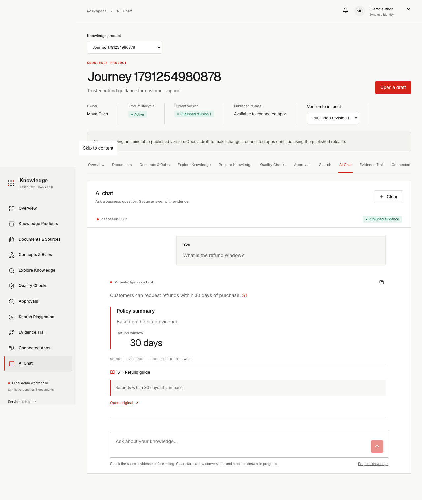

# Knowledge Product Manager

Turn business documents and records into versioned knowledge that people and applications can trust. Create a product, bring in data, prepare it, check its quality, request approval, and publish a release. Search and AI chat show the evidence behind their answers.

The interface uses plain business language, a light theme, red accents, flat grid/block layouts, Inter and Geist typography, and a decorative halftone shader with reduced-motion and GPU fallbacks. RDF, Turtle, graph mappings, and other technical details are available in advanced views.



## What you can do

| Capability | Implemented behavior |
|---|---|
| Product onboarding | Five steps: purpose, data, concepts, readiness preferences, and review; incomplete drafts are allowed. |
| Mixed imports | Preview and import CSV, JSON records, Turtle, PDF, DOCX, text, and Markdown. |
| Source connections | Read bounded PostgreSQL table and HTTP API snapshots; register other source locations and import their exports. |
| Concepts and rules | Guided business forms and starters backed by versioned RDF/SHACL and explicit graph mappings. |
| Preparation | Separate worker extracts text, creates evidence chunks, embeds them, builds facts, and runs checks; attempts and retries are recorded. |
| Quality and governance | Seven measured dimensions, current-input review evidence, separate demo reviewer, immutable published revisions. |
| Search | Vector, graph, and hybrid retrieval scoped to a published release or an explicitly selected draft preview. |
| AI chat | Streaming assistant-ui/Blume chat, cited originals, validated fact/table cards, DeepSeek through OpenRouter and a Claude Agent SDK/LiteLLM gateway. |
| Connected applications | Active-release or pinned-release associations; dependency resolution and clearly labeled simulated usage. |
| Evidence trail | Documents, concepts, mappings, builds, evaluations, reviews, and releases remain traceable. |

This is a local, single-workspace MVP. Identities are synthetic; production authentication and authorization are not implemented. Unstructured document fact extraction uses deterministic demo rules, while structured records and Turtle instance data are imported directly. Read [scope and limitations](docs/limitations.md) before treating this as a production system.

## Documentation

| Guide | Read it for |
|---|---|
| [Documentation index](docs/README.md) | All guides and generated references. |
| [Architecture](docs/architecture.md) | Components, storage responsibilities, request flows, consistency, and extension seams. |
| [Data model](docs/data-model.md) | Domain entities, relationships, lifecycle, release manifests, and migrations. |
| [API guide](docs/api.md) | Contracts, curl examples, errors, revision scope, streaming chat, and private gateway behavior. |
| [OpenAPI 3.1 specification](docs/api/openapi.json) | Machine-readable public request schemas; also available at `/openapi.json` on the API. |
| [Endpoint reference](docs/api/endpoints.md) | All 56 public operations generated from the routes. |
| [Database dictionary](docs/reference/database.md) | Columns, types, nullable fields, keys, defaults, and unique constraints for all 16 tables. |
| [Configuration](docs/configuration.md) | Infrastructure, model, source, and chat settings. |
| [Operations](docs/operations.md) | Host/container startup, health, migrations, backup, recovery, and reset. |
| [Business user guide](docs/user-guide.md) | Onboarding through publication and everyday search/chat. |
| [Contributing](CONTRIBUTING.md) | Development workflow, checks, documentation generation, and implementation conventions. |

## Run locally

Use **Python 3.12**, **uv**, **Docker with Compose v2**, and **Node.js 22.12+** (Node 24 recommended) with npm. Node 20 is not sufficient for all current Blume dependencies. `make` is used for convenience commands. First-time installation and the embedding-model download require network access.

From the repository root:

```sh
git clone https://github.com/Joseph-k-iype/kg-product.git
cd kg-product
cp .env.example .env
chmod 600 .env
make install
make services
make migrate
make model
make seed
```

Start each process in its own terminal, also from the repository root:

```sh
make api
```

```sh
make worker
```

```sh
make dev
```

Open [the application](http://127.0.0.1:5174/overview). The seed skips nonempty workspaces and includes HR Policies, Payments, Customer Complaints, and Application Estate in different readiness states. Select a product, inspect its data and concepts, then prepare/check/review/publish it. Synthetic fixture documents are under `fixtures/`.

| Service | Local address | Purpose |
|---|---|---|
| Frontend | `http://127.0.0.1:5174` | React/Vite application; proxies `/api` to the API. |
| API | `http://127.0.0.1:58000` | FastAPI business and chat endpoints. |
| Swagger UI | `http://127.0.0.1:58000/docs` | Interactive public API schema. |
| ReDoc | `http://127.0.0.1:58000/redoc` | Readable generated API reference. |
| PostgreSQL | `localhost:55432` | Relational metadata and pgvector evidence index. |
| MinIO | `http://localhost:59000` | Immutable content-addressed objects. |
| MinIO console | `http://localhost:59001` | Local artifact inspection. |
| FalkorDB | `localhost:56379` | Redis-protocol graph service. |

The example database/storage passwords are **local demo defaults**. Actual provider keys and source credentials belong only in the ignored `.env` or server process environment. The application can run without an LLM key; AI chat will report that its server connection needs configuration.

## Enable AI chat

Set these values in the root `.env`, then restart the API:

```dotenv
OPENROUTER_API_KEY=
CHAT_GATEWAY_TOKEN=
CHAT_MODEL=deepseek/deepseek-v3.2
CHAT_GATEWAY_URL=http://127.0.0.1:58000/internal/llm
```

Supply your own OpenRouter key and a random gateway token. Generate a token locally with `python3 -c 'import secrets; print(secrets.token_urlsafe(32))'`, then paste it into `.env`. Do not commit or send these values to the browser.

The runtime path is **Claude Agent SDK → authenticated local Anthropic Messages gateway → LiteLLM translation → OpenRouter OpenAI-compatible Chat Completions → DeepSeek**. The SDK uses custom read-only knowledge/presentation tools. This setup does not require an Anthropic model subscription. Prepare the selected version first, then open **AI Chat** and ask a business question. The browser shows citations and validated cards; generated conclusions still need to be checked against the originals.

Chat history lives in the open view. Clear, a product change, or a version change starts a new conversation. Run metadata is retained in bounded server memory rather than a durable conversation database. See [chat architecture](docs/chat-design.md) and the [library documentation review](docs/chat-ui-research.md).

## Bring in your data

Onboarding and Documents & Sources support mixed file imports. Up to 20 files, 20 MB each, and 100 MB total can be submitted during onboarding. CSV/JSON imports are UTF-8 and bounded to 10,000 records and 100 fields; Turtle is bounded to 2 MB and 50,000 statements. Scanned PDFs need OCR before import.

To read a database or API, configure a server credential reference such as `SOURCE_SALES_DATABASE_URL` or `SOURCE_CRM_TOKEN`; source metadata stores the reference name, not its value. HTTP API origins must be explicitly approved. See [connection setup](docs/source-connections.md) for read-only accounts, record limits, records paths, timeouts, and container networking.

Imports are manual snapshots. A changed source snapshot supersedes prior data only in the editable draft. Earlier published releases and immutable originals are preserved. No periodic synchronization, automatic API pagination, or native cloud/business-app reader is implemented.

## Container alternative

`make up` starts the three storage services plus API and worker containers. Run `make dev` separately for the frontend. Do not run host and container API/worker processes simultaneously. Migrations run at container API startup; the host and container embedding caches are separate.

Initialize the container model cache after startup:

```sh
docker compose exec api python -c "from sentence_transformers import SentenceTransformer; from app.adapters.embeddings import MODEL_NAME,MODEL_REVISION; SentenceTransformer(MODEL_NAME,revision=MODEL_REVISION,cache_folder='/models',trust_remote_code=False)"
```

The container loads the root `.env` through Compose, with internal storage URLs and chat loopback overridden by Compose. For seeding, use the host installation's `make migrate`, `make model`, and `make seed` against the same loopback services. See [operations](docs/operations.md) for the two runtime paths and recovery.

## Verify and build

```sh
make test         # all backend tests; real services and local embedding model required
make test-fast    # skips tests marked model; still requires storage services
make test-e2e     # running API/worker/frontend; installs Chromium if needed
make build        # TypeScript check and Vite production output
make docs         # regenerate public API and ORM reference files
make docs-check   # fail on reference drift; no model/provider calls
```

Backend tests use a dedicated `knowledge_test` database. Browser tests use the running local workspace and retain inspectable synthetic QA products. The [verification record](docs/verification.md) records actual executed results and distinguishes runtime acceptance from provider test doubles. Browser chat tests stub the external generation seam; separate real DeepSeek calls verified the complete agent/gateway path.

The backend `uv.lock` and container `requirements.lock`, frontend npm lock, Blume peer-resolution `.npmrc`, and compatible routing dependency override are checked in. The generative chat bundle loads lazily. See [contributing](CONTRIBUTING.md) before changing pinned adapter dependencies.

## Repository layout

```text
backend/
  app/adapters/             Storage, RDF/SHACL, vectors, graph, source readers
  app/domain/               Shared artifact, revision, model, evidence contracts
  app/features/             Product, imports, preparation, governance, search, chat
  alembic/versions/         Migrations 001–010
  tests/                    Unit and integration coverage
frontend/
  src/components/          Shared shell, business controls, shader decoration
  src/features/            Product workflows and AI chat
  tests/e2e/               Browser and accessibility workflows
scripts/                   Seed, model download, test DB, reset, reference export
fixtures/                  Synthetic document and ontology examples
docs/                      Guides, generated contracts, screenshots, decisions
design/                    Retained original design references
compose.yaml               Local storage/API/worker runtime
Makefile                   Repeatable development and documentation commands
```

PostgreSQL is the authority for workflow and release activation; MinIO holds originals, extracted text, canonical Turtle, and manifests; FalkorDB holds build-scoped facts. Read [architecture](docs/architecture.md) for why each store exists and how exact release snapshots prevent mixing versions.

WeKnora's document-first onboarding, processing timelines, cited search, and modularity informed the experience; no WeKnora source was copied. See [Tencent/WeKnora](https://github.com/Tencent/WeKnora). Original design decisions and the approved initial specification are retained under `docs/` and `docs/superpowers/`; the current code and current guides take precedence over historical plans.
