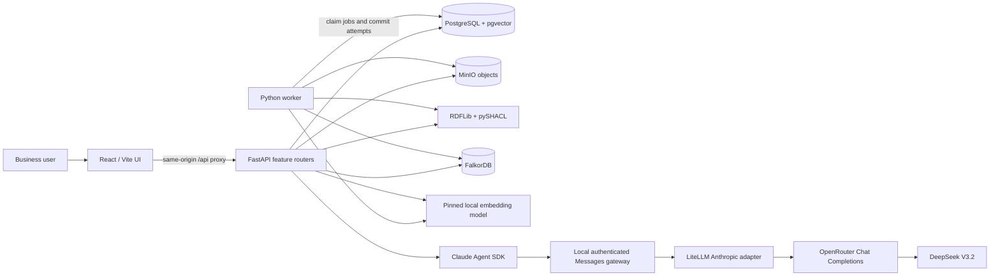
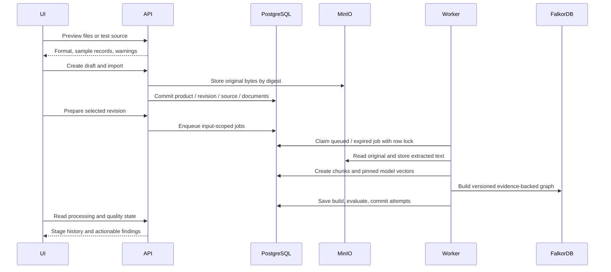
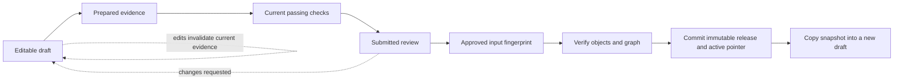

# Architecture

Knowledge Product Manager is a modular FastAPI application with a separate PostgreSQL-backed worker and a React/Vite frontend. The primary design rule is that each answer, graph fact, review, and release must identify the evidence and version that produced it.

## Component map

| Component | Responsibility | Implementation |
|---|---|---|
| UI | Business workflows, revision selection, citations, accessibility, streaming transcript/cards | `frontend/src/features/`, shared shell, React Router, assistant-ui and Blume |
| API | Validation, scope resolution, workflow mutations, artifact orchestration, retrieval, chat gateway | `backend/app/main.py` and `features/*/routes.py` |
| Worker | Durable preparation jobs, leases, attempts, stage chaining | `backend/app/worker.py` |
| PostgreSQL | Authoritative metadata, revision generation, queue, governance, active release | SQLAlchemy, psycopg, Alembic |
| pgvector | 384-dimensional evidence vectors, cosine-distance retrieval | `chunks.embedding`, scoped queries, HNSW index |
| MinIO | Original files, extracted text, canonical Turtle, release manifests | Content-addressed `sha256/<digest>` keys |
| RDF layer | Parse and inspect vocabularies, validate supported SHACL constraints | RDFLib and pySHACL; no separate RDF database |
| FalkorDB | Instance nodes and relationships for a specific graph build | Redis protocol; parameterized Cypher |
| Local encoder | Document and query vectors using one pinned model revision | SentenceTransformers all-MiniLM-L6-v2 |
| AI gateway | Translate SDK Anthropic Messages into OpenAI-compatible calls and back | Pinned LiteLLM adapter with server-only provider credentials |

The API and worker share relational models and business services. Features are organized by domain rather than by a single generic repository/controller abstraction. Thin route handlers accept request schemas, resolve sessions and revision scope, then delegate to services. External behavior is behind adapters; see [adapter contracts](adapters.md).

## Storage boundaries

**PostgreSQL is the workflow authority.** A product has numbered revisions and an active release pointer. Documents/chunks, ontology/mapping versions, graph builds, job attempts, evaluations, review decisions, consumer associations, and activity live here. JSON columns retain snapshots and structured payloads. The database is not used as an RDF triplestore.

**MinIO stores reproducible bytes.** The application computes a SHA-256 digest for each object and uses that digest as its key. Reads verify the digest; publication rechecks every required original, extracted artifact, ontology, and manifest. This is application-level content addressing, not an S3 Object Lock retention policy. Identical bytes can share an object key. Draft replacement changes metadata selection without deleting earlier originals.

**FalkorDB stores build-scoped instances.** A graph key includes the database/workspace scope, product, revision, and immutable build identity. Ontology classes/properties map explicitly to graph labels/property keys. The SQL graph-build record also retains instance/relationship payloads and evidence. Published queries resolve the manifest's build rather than a mutable global graph.

The stores do not share a distributed transaction. External objects/builds can exist after a PostgreSQL rollback. Content-addressed objects and deterministic build fingerprints let retries reuse verified artifacts; PostgreSQL controls which artifacts are visible or active.

## Import and preparation flow

Uploads validate size and format before committing relational creation. The onboarding handler completes its database transaction before returning success, using FastAPI function-scoped session dependencies. A failed import/source read rolls back the product metadata. Uploaded content-addressed objects may remain unreferenced after rollback; there is no automatic object garbage collector.

CSV/JSON becomes normalized records with original evidence. Turtle may contain definitions, instance facts, or both. Vocabulary declarations and mappings are merged without changing original IRIs. Unstructured text/PDF/DOCX produces extracted text and chunks; graph fact extraction uses documented deterministic demo rules. Native database/API readers import bounded snapshots, not continuously queried remote datasets.

The worker claims jobs using `FOR UPDATE SKIP LOCKED`, records attempts, and sets a 30-minute lease. Stage processing locks the revision before the job, matching preparation/edit lock order. Stages chain extraction → chunking → embedding → graph build; graph completion runs evaluation. Failed attempts retain errors; explicit retry requeues them. Inactive superseded documents do not enter current preparation. There is no general external queue or automatic retry schedule.

## Revision and publication consistency

1. Editing content/settings increments a revision generation and clears current graph readiness. Historical rows remain.
2. Evaluation snapshots include product metadata, configuration, active documents/chunks, ontology/mapping/build identities, model identity, and source freshness state. A canonical JSON hash identifies the evaluated inputs.
3. Review submission requires current passing checks. The decision references the same fingerprint and rejects stale or self-approved demo requests.
4. Publication verifies required MinIO objects and the graph build, prepares a manifest, and rechecks the fingerprint.
5. In one PostgreSQL transaction, it creates the release, marks the revision published, and updates the product's active release pointer.

A publication error leaves the previous active release intact. No draft mutation route can edit a published revision. Product catalog metadata remains mutable through drafts; release manifests preserve the metadata at publication time. Active consumers follow the pointer; pinned consumers resolve their selected release.

## Retrieval

`resolve_inputs` chooses the selected draft preview or a product-owned release. Published retrieval takes exact chunk IDs, model identity, and graph-build scope from the release manifest. Draft retrieval excludes inactive source snapshots.

- **Vector:** embed the query locally, validate model name/revision/dimension against every selected chunk, then rank cosine distance in pgvector.
- **Graph:** search mapped instance attributes and retain exact source evidence.
- **Hybrid:** vector matches enriched with related graph facts. This is not an LLM planner or a learned ranking fusion.

Responses contain scores, source excerpts/offsets, document IDs, original URLs, and diagnostics with revision/generation/release identities. Missing preparation or a model mismatch fails explicitly rather than silently switching to lexical search.

## AI chat

Blume's `useAssistant` provides a plain UTF-8 text stream. assistant-ui's external store runtime displays the transcript/composer/actions. A separate metadata request carries source citations and a validated generative tree.

The server retrieves scoped evidence before starting the agent. Each conversation has a UUID; every turn has its own request UUID. Reservations are atomic and limited to three active conversations per API process. Metadata has bounded retention (up to 500 packets, 30-minute age) and is product/request scoped. The UI waits for the exact turn packet and resets when the product/version changes, so a refused follow-up cannot reuse the prior turn's facts.

Claude Agent SDK owns a child runtime in a temporary working directory with project/user settings disabled. Only `search_evidence`, `product_readiness`, and `present` custom tools are permitted; built-in shell/filesystem/edit tools are unavailable. Search tools keep the captured revision/release scope. The local gateway authenticates the SDK, translates with LiteLLM, and forces the server-selected DeepSeek model at OpenRouter.

Text, SDK transport, translated event iterators, and the actual provider stream have explicit lifetime ownership. The answer deadline uses an AnyIO cancellation scope so shielded SDK cleanup can finish. Clear aborts the browser request; cancellation may take the SDK shutdown grace period. Errors are sanitized before entering browser streams/provider logs.

Generative components are restricted to Col, Row, Card, Fact, Table, and Evidence; tree depth, count, size, fields, and citation IDs are checked. Markdown HTML and outbound images are disabled; links resolve to known citations. Generated content cannot introduce actions or arbitrary source URLs. These controls reduce unsafe display/agent behavior; they do not make model conclusions authoritative. See [chat design](chat-design.md) for implementation contracts.

## Runtime and extension seams

Host development runs API, worker, and Vite separately against Compose storage. Container mode runs API/worker alongside storage; the frontend remains a separate development/build process. Internal compose addresses differ from host loopback addresses. The current chat registry requires one API process: multiple workers/replicas need shared request storage and coordinated admission.

The project can grow through explicit seams: real identity and authorization at API boundaries, stronger extraction behind the existing evidence contract, managed S3-compatible storage, a durable chat store, or a different job runner that preserves locking/idempotency. A different embedding dimension requires a migrated/separate vector index; a remote RDF store requires its own persistence/query abstraction. Read [limitations](limitations.md) for the present production gaps.
