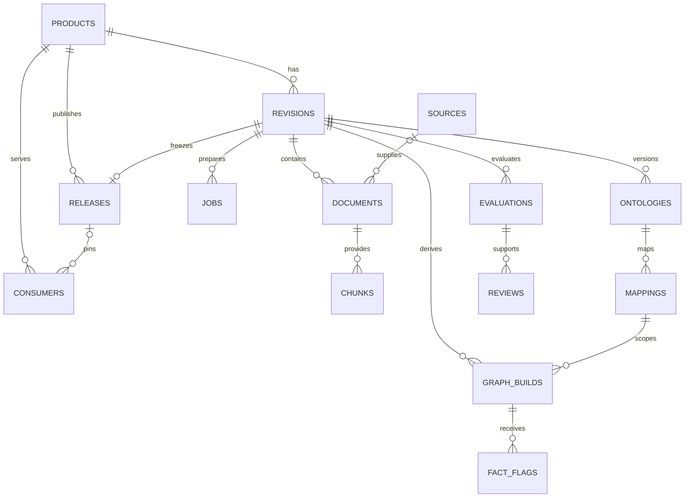

# Data model

The application stores 16 domain tables in PostgreSQL, original/derived bytes in MinIO, and versioned instance graphs in FalkorDB. The [generated database dictionary](reference/database.md) is the column-level reference. This guide explains the relationships and invariants that columns alone do not express.

## Domain terms

| Term | Meaning |
|---|---|
| Product | Business purpose, owner, domain, catalog identity, and active published release. |
| Revision | A numbered version of a product's knowledge; editable until published. |
| Generation | Increasing counter for changes within one revision; invalidates dependent evidence. |
| Source | A registered location/reader configuration associated with one or more products. |
| Document | One revision-scoped imported file or source snapshot plus original object identity. |
| Chunk | An evidence excerpt with text, start/end offsets, processing version, and optional embedding. |
| Ontology version | Immutable canonical Turtle artifact describing concepts, properties, and constraints. |
| Mapping version | Explicit ontology-IRI to FalkorDB label/property mapping. |
| Graph build | Instance/relationship output for identified revision inputs and extraction version. |
| Evaluation | Seven measured quality dimensions plus the exact input snapshot and fingerprint. |
| Review | Human/demo decision attached to current evaluated inputs. |
| Release | Immutable publication manifest and artifact, selected by active/pinned consumers. |
| Consumer | Application/product association following active or pinned publication. |
| Chat run | Ephemeral per-turn request packet; not a PostgreSQL table or durable conversation. |

## Relational map

This is a simplified logical relationship diagram, not a complete DDL diagram. `activity` also references product/revision; `evaluation_cases` references product. `sources.product_ids` is a JSON list, not a join table. `products.active_release_id` and revision ontology/mapping/build pointers are plain nullable strings whose scope is enforced by services rather than database foreign keys. Use the generated dictionary to distinguish actual FK constraints from logical references.

IDs are UUID-shaped strings stored as `VARCHAR(36)`, not PostgreSQL's native UUID type. Timestamps are timezone-aware. Structured arrays/maps use SQLAlchemy JSON columns. Models do not define ORM cascade deletion; reset explicitly orders deletions.

## Entity groups

| Group | Tables | Important fields and semantics |
|---|---|---|
| Catalog/version | `products`, `revisions`, `activity` | Product business metadata, revision number/generation/state/config, artifact pointers, actor/action/detail. |
| Data/evidence | `sources`, `documents`, `chunks` | Reader references, source freshness, normalized records, active snapshot flag, SHA/object keys, offsets/vectors/model identity. |
| Preparation | `jobs` | Stage/input hash, queue state, worker lease, attempt count/history, error; document may be null for revision graph jobs. |
| Meaning/facts | `ontologies`, `mappings`, `graph_builds`, `fact_flags` | Versioned vocabulary/mapping, scoped external graph, JSON facts/relationships, correction requests tied to exact build/entity. |
| Quality/governance | `evaluation_cases`, `evaluations`, `reviews`, `releases` | Saved search expectations, check evidence/fingerprint, decisions/diffs, manifest artifact and publication sequence. |
| Consumption | `consumers` | Product, type, active/pinned policy, optional release FK, simulated usage. |

Evaluation cases currently store saved retrieval expectations; the seven publication gates are computed independently and do not incorporate an automated search benchmark score.

## Revision lifecycle and concurrency

Persisted revision states are `draft`, `submitted`, `approved`, and `published`. Preparation/check status is derived from jobs/artifacts/evaluations rather than a separate `ready` revision state. Rejection returns the revision to `draft`; editing also returns it to `draft`, increments generation, and clears `graph_build_id`.

Most mutations lock the selected revision. Product metadata updates require `expected_generation`; several ontology/mapping requests also accept it. A generation conflict returns 409. Published mutations return 409 and require opening a new draft.

Opening a draft copies the latest revision's configuration, ontology/mapping pointers, active documents, chunks, vectors, processing identities, and original object references. New document/chunk IDs belong to the new revision; storage bytes may be reused. A current graph build and new review are still required. Product names/owners are stored on the product, while releases retain the publication-time metadata snapshot.

## Sources, document snapshots, and evidence

A source's `config` stores names such as `SOURCE_SALES_DATABASE_URL`, schema/table, record cap, or API records path/format. Credentials are resolved from server environment, never persisted in these fields. Source associations are a JSON product-ID list validated by services.

Documents retain original name/type/size/object key/digest plus extracted artifact and text. `data_kind` distinguishes documents, structured records, RDF, or definition-only inputs; `structured_data` holds normalized records/vocabulary/term provenance. `active=false` marks a replaced source snapshot in an editable draft. It does not erase the original or earlier release references.

Source refresh compares original digest and normalized selection. Identical snapshots are reused; changed snapshots become current and prior snapshots are superseded only in the draft. Jobs for superseded documents are excluded or marked superseded. Current facts/checks/vector queries exclude inactive inputs.

Chunks retain document/revision/product identity, ordinal, processing version, text offsets and optional `VECTOR(384)`. New DOCX extraction includes tables and nested cells in body order and records `extract-docx-v2/chunk-v1`; cached prepared documents retain their existing artifacts/version. For extracted text, offsets refer to extracted text; normalized records use their generated evidence text rather than the raw byte layout of CSV/JSON/Turtle. Citations retain original URLs plus exact excerpt text, so a consumer can inspect the source representation.

The embedding identity is the tuple `(model_name, model_revision, model_dimension)`. Both document and query vectors use `sentence-transformers/all-MiniLM-L6-v2`, revision `1110a243fdf4706b3f48f1d95db1a4f5529b4d41`, dimension 384. A model mismatch prevents retrieval. DeepSeek is the answer model, not the embedding model.

## Ontology, mappings, and graphs

`ontologies` stores the canonical Turtle key/digest, version number, and unsupported-construct warnings. `mappings.definition` contains class IRI/label entries and property IRI/key/kind entries. Guided forms create IRIs and default mappings; advanced editors can inspect them.

`graph_builds` stores generation, ontology/mapping IDs, input hash, graph key, state, extraction version, instances, and relationships. Instance/relationship payloads include source evidence. They are mirrored into a build-scoped FalkorDB graph rather than stored in normalized SQL node/edge tables. A flag references a SQL build and external entity ID; it records a concern and does not directly rewrite published facts.

## Evaluation and release manifests

Evaluation input snapshots include:

- Product/revision/generation and publication-time metadata/configuration.
- Ontology ID/digest, mapping ID/definition, graph-build identity, and inspected definitions.
- Active document IDs, original/extracted keys and digests, source IDs, processing versions.
- Chunk IDs/offsets/text digests and vector model identities.
- Source synchronization timestamps, freshness windows/deadlines, and computed freshness.

Business text is trimmed in evaluation metadata snapshots so whitespace cannot satisfy completeness; old fingerprints containing outer whitespace become stale. A SHA-256 hash of canonical JSON is the fingerprint. Evaluation results have measured values/thresholds/states/findings; reviews reference the same input hash. A change or freshness expiry can make evidence stale without deleting its history. Current passing checks and approval are checked again when publishing.

The release manifest extends the snapshot with exact document/chunk ID lists, ontology object key, embedding model, evaluation/review IDs, input hash, and graph key. Its bytes are stored and verified in MinIO; the release row keeps the same manifest JSON plus object key/digest. Release numbers are unique per product, and one revision can have only one release.

## Constraints and indexes

| Constraint/index | Purpose |
|---|---|
| `chunks(document_id, ordinal, processing_version)` unique | Avoid duplicate excerpt identities for unchanged processing. |
| `jobs(document_id, stage, input_hash)` unique | Deduplicate document stage work. |
| `jobs_revision_stage_idx` unique partial index where document is null | Deduplicate revision-level graph work despite SQL null uniqueness semantics. |
| `graph_builds(revision_id, input_hash)` unique | Reuse deterministic graph output across retries. |
| `releases(product_id, number)` and `releases(revision_id)` unique | Stable publication sequence and one release per revision. |
| `chunks_scope_idx(product_id, revision_id)` | Scope evidence scans. |
| `chunks_embedding_idx` HNSW / `vector_cosine_ops` | Vector nearest-neighbor access path. |

The three named indexes above are defined in migrations rather than ORM metadata. The generated dictionary therefore does not list them. Product/revision scope checks and expected-generation checks remain service responsibilities; not every logical invariant is a SQL constraint.

## Migration chain

| Revision | Change |
|---|---|
| 001 | pgvector extension and product/revision/activity foundation. |
| 002 | Sources, documents, chunks, and jobs. |
| 003 | Ontology and mapping versions. |
| 004 | Evaluation cases and scoped/vector indexes. |
| 005 | Graph builds and fact flags. |
| 006 | Evaluations, reviews, and releases. |
| 007 | Consumers. |
| 008 | Explicit preparation flag and revision-stage unique index. |
| 009 | Structured import payloads and source reader configuration. |
| 010 | Active/current source snapshot flag. |

Alembic version IDs are strings `001` through `010`. Use `make migrate`; `metadata.create_all()` is not the migration workflow and omits migration-only indexes. Chat adds no SQL tables. There is no automatic garbage collection or retention policy for immutable originals, historical builds, evaluations, or releases; see [operations](operations.md) for coordinated backups/reset.
